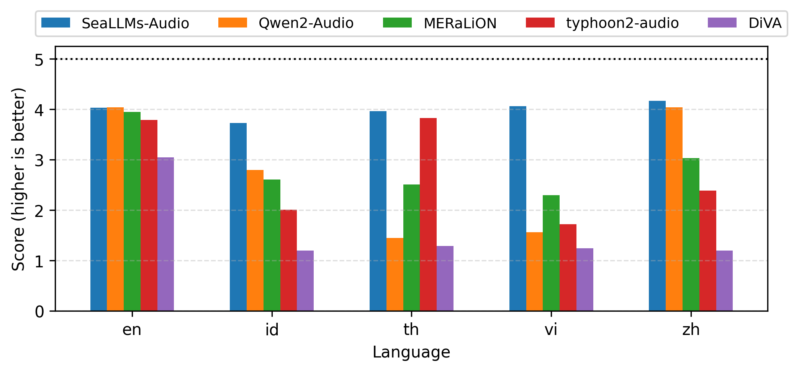
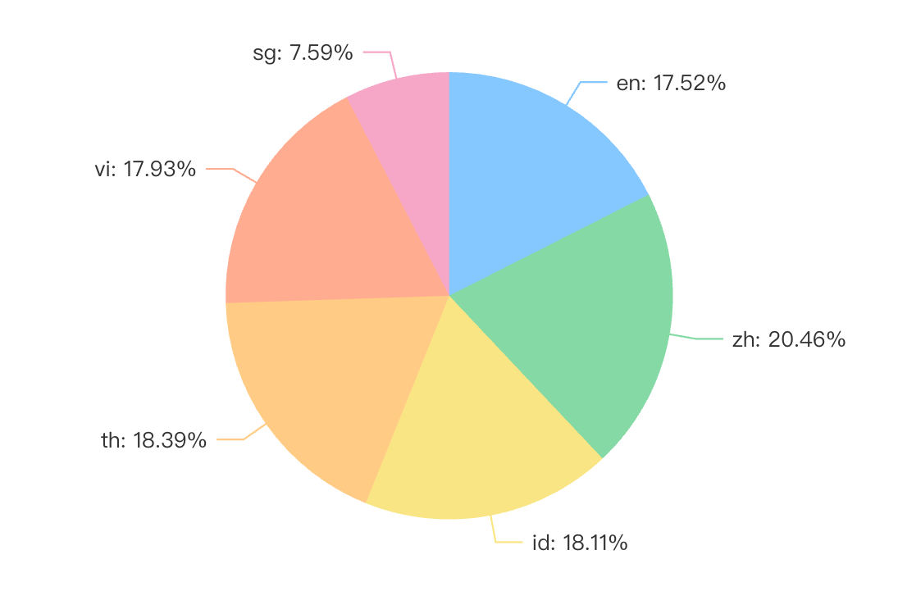
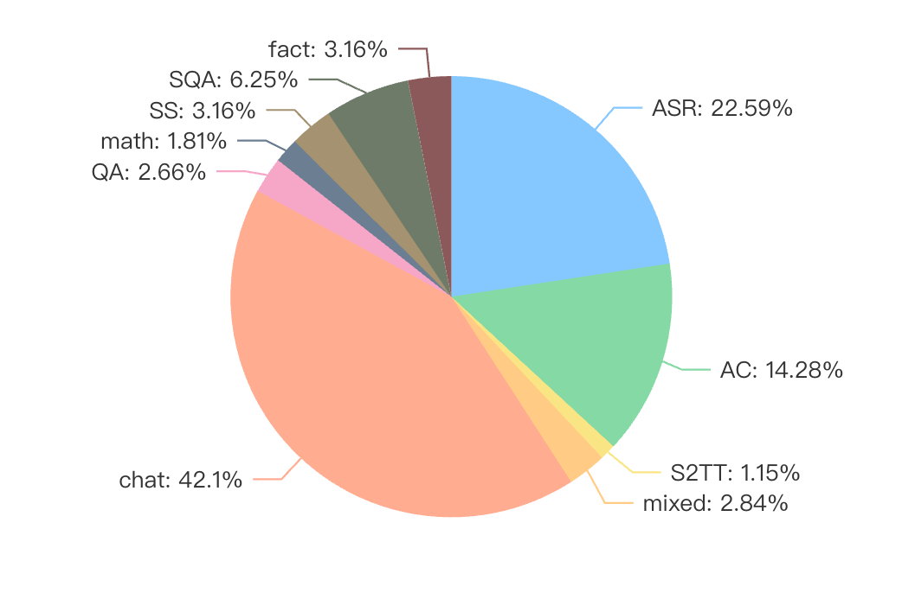

<p align="center">
    
</p>

# SeaLLMs-Audio: Large Audio-Language Models for Southeast Asia

<p align="center">
<a href="https://damo-nlp-sg.github.io/SeaLLMs-Audio/" target="_blank" rel="noopener">Website</a>
&nbsp;&nbsp;
<a href="https://arxiv.org/abs/2511.01670" target="_blank" rel="noopener">📖 Paper</a>
&nbsp;&nbsp;
<a href="https://huggingface.co/spaces/SeaLLMs/SeaLLMs-Audio-Demo" target="_blank" rel="noopener"> 🤗 DEMO</a>
&nbsp;&nbsp;
<a href="https://github.com/DAMO-NLP-SG/SeaLLMs-Audio" target="_blank" rel="noopener">Github</a>
&nbsp;&nbsp;
<a href="https://huggingface.co/SeaLLMs/SeaLLMs-Audio-7B" target="_blank" rel="noopener">🤗 Model</a>
&nbsp;&nbsp;
<a href="https://huggingface.co/datasets/SeaLLMs/SeaBench-Audio" target="_blank" rel="noopener">🤗 Benchmark</a>
&nbsp;&nbsp;
<!-- <a href="https://arxiv.org/pdf/2407.19672" target="_blank" rel="noopener">[NEW] Technical Report</a> -->
</p>

# News

* [Dec 7, 2025] We released the [script](SeaBench_Audio) and [dataset](https://huggingface.co/datasets/SeaLLMs/SeaBench-Audio) for SeaBench-Audio, an audio benchmark for Large Audio Language Models for Southeast Asia.
* [Nov 3, 2025] We released the paper for [SeaLLMs-Audio](https://arxiv.org/abs/2511.01670).
* [Mar 22, 2025]  We released the training script for SeaLLMs-Audio. [[Code](scripts)]
* [Mar 17, 2025] 🚀 We rolled out SeaLLMs-Audio-7B, the first multimodal (audio) extension of the [SeaLLMs](https://damo-nlp-sg.github.io/DAMO-SeaLLMs/) family.

# Introduction

We introduce **SeaLLMs-Audio**, the multimodal (audio) extension of the [SeaLLMs](https://damo-nlp-sg.github.io/DAMO-SeaLLMs/) (Large Language Models for Southeast Asian languages) family. It is the first large audio-language model (LALM) designed to support multiple Southeast Asian languages, including **Indonesian (id), Thai (th), and Vietnamese (vi), alongside English (en) and Chinese (zh)**. 

Trained on a large-scale audio dataset, SeaLLMs-Audio demonstrates strong performance across various audio-related tasks, such as audio analysis tasks and voice-based interactions. As a significant step toward advancing audio LLMs in Southeast Asia, we hope SeaLLMs-Audio will benefit both the research community and industry in the region.

### Key Features of SeaLLMs-Audio:

- **Multilingual**: The model mainly supports 5 languages, including 🇮🇩 Indonesian, 🇹🇭 Thai, 🇻🇳 Vietnamese, 🇬🇧 English, and 🇨🇳 Chinese.
- **Multimodal**: The model supports flexible input formats, such as **audio only, text only, and audio with text**.
- **Multi-task**: The model supports a variety of tasks, including audio analysis tasks such as audio captioning, automatic speech recognition, speech-to-text translation, speech emotion recognition, speech question answering, and speech summarization. Additionally, it handles voice chat tasks, including answering factual, mathematical, and other general questions.

We open-weight [SeaLLMs-Audio](https://huggingface.co/SeaLLMs/SeaLLMs-Audio-7B) on Hugging Face, and we have built a [demo](https://huggingface.co/spaces/SeaLLMs/SeaLLMs-Audio-Demo) for users to interact with.

# Performance
Due to the absence of standard audio benchmarks for evaluating audio LLMs in Southeast Asia, we have manually created a benchmark called **SeaBench-Audio**. It comprises nine tasks:

- **Tasks with both audio and text inputs:** Audio Captioning (AC), Automatic Speech Recognition (ASR), Speech-to-Text Translation (S2TT), Speech Emotion Recognition (SER), Speech Question Answering (SQA), and Speech Summarization (SS).
- **Tasks with only audio inputs:** Factuality, Math, and General.

We manually annotated 15 questions per task per language. For evaluation, qualified native speakers rated each response on a scale of 1 to 5, with 5 representing the highest quality.

Due to the lack of LALMs for all the three Southeast Asian languages, we compare the performance of SeaLLMs-Audio with relevant LALMs with similar sizes, including: [Qwen2-Audio-7B-Instruct](https://huggingface.co/Qwen/Qwen2-Audio-7B-Instruct) (Qwen2-Audio), [MERaLiON-AudioLLM-Whisper-SEA-LION](https://huggingface.co/MERaLiON/MERaLiON-AudioLLM-Whisper-SEA-LION) (MERaLiON), [llama3.1-typhoon2-audio-8b-instruct](https://huggingface.co/scb10x/llama3.1-typhoon2-audio-8b-instruct) (typhoon2-audio), and [DiVA-llama-3-v0-8b](https://huggingface.co/WillHeld/DiVA-llama-3-v0-8b) (DiVA).
All the LALMs can accept audio with text as input. The results are shown in the figure below.

<center>

**Average scores of SeaLLMs-Audio vs. Other LALMs on SeaBench-Audio**



</center>

The results shows that SeaLLMs-Audio achieve state-of-the-art performance in all the five langauges, demonstrating its effectiveness in supporting audio-related tasks in Southeast Asia.


# Training information
SeaLLMs-Audio builts upon [Qwen2-Audio-7B](https://huggingface.co/Qwen/Qwen2-Audio-7B) and [Qwen2.5-7B-Instruct](https://huggingface.co/Qwen/Qwen2.5-7B-Instruct). We replaced the LLM module in Qwen2-Audio-7B by Qwen2.5-7B-Instruct. After that, we do full-parameter fine-tuning on a large-scale audio dataset. This dataset contains 1.58M conversations for multiple tasks, in which 93% are single turn. The tasks can be roughly classified as following task categories:  automatic speech recognition (ASR), audio captioning (AC), speech-to-text translation (S2TT), question answering (QA),  speech summarization (SS), speech question answering (SQA), chat, math, and fact and mixed tasks (mixed).

The distribution of data across languages and tasks are:

<p align="center">
    <strong>Distribution of SeaLLMs-Audio training data across languages and tasks</strong>
</p>

<p align="center">
    
    
</p>

The training dataset was curated from multiple data sources, including public datasets and in-house data. Public datasets includes: [gigaspeech](https://huggingface.co/datasets/speechcolab/gigaspeech), [gigaspeech2](https://huggingface.co/datasets/speechcolab/gigaspeech2), [common voice](https://huggingface.co/datasets/mozilla-foundation/common_voice_17_0), [AudioCaps](https://huggingface.co/datasets/OpenSound/AudioCaps), [VoiceAssistant-400K](https://huggingface.co/datasets/gpt-omni/VoiceAssistant-400K), [YODAS2](https://huggingface.co/datasets/espnet/yodas2), and [Multitask-National-Speech-Corpus](https://huggingface.co/datasets/MERaLiON/Multitask-National-Speech-Corpus-v1). We would like to thank the authors of these datasets for their contributions to the community!

We train the model on the dataset for 1 epoch, which took ~6 days to complete on 32 A800 GPUs.

# Quickstart
Our model is available on Hugging Face, and you can easily use it with the `transformers` library or `vllm` library. Below are some examples to get you started.

## Inference with `transformers`

You can try the model by runing ```"python scripts/infer_transformers.py"```" or with the following code snippet.

```python
from transformers import Qwen2AudioForConditionalGeneration, AutoProcessor
import librosa
import os

model = Qwen2AudioForConditionalGeneration.from_pretrained("SeaLLMs/SeaLLMs-Audio-7B", device_map="auto")
processor = AutoProcessor.from_pretrained("SeaLLMs/SeaLLMs-Audio-7B")

def response_to_audio(conversation, model=None, processor=None):
    text = processor.apply_chat_template(conversation, add_generation_prompt=True, tokenize=False)
    audios = []
    for message in conversation:
        if isinstance(message["content"], list):
            for ele in message["content"]:
                if ele["type"] == "audio":
                    if ele['audio_url'] != None:
                        audios.append(librosa.load(
                            ele['audio_url'], 
                            sr=processor.feature_extractor.sampling_rate)[0]
                        )
    if audios != []:
        inputs = processor(text=text, audios=audios, return_tensors="pt", padding=True,sampling_rate=16000)
    else: 
        inputs = processor(text=text, return_tensors="pt", padding=True)
    inputs.input_ids = inputs.input_ids.to("cuda")
    inputs = {k: v.to("cuda") for k, v in inputs.items() if v is not None}
    generate_ids = model.generate(**inputs, max_new_tokens=2048, temperature = 0, do_sample=False)
    generate_ids = generate_ids[:, inputs["input_ids"].size(1):]
    response = processor.batch_decode(generate_ids, skip_special_tokens=True, clean_up_tokenization_spaces=False)[0]
    return response

# Voice Chat
os.system(f"wget -O fact_en.wav https://damo-nlp-sg.github.io/SeaLLMs-Audio/static/audios/fact_en.wav")
os.system(f"wget -O general_en.wav https://damo-nlp-sg.github.io/SeaLLMs-Audio/static/audios/general_en.wav")
conversation = [
    {"role": "user", "content": [
        {"type": "audio", "audio_url": "fact_en.wav"},
    ]},
    {"role": "assistant", "content": "The most abundant gas in Earth's atmosphere is nitrogen. It makes up about 78 percent of the atmosphere by volume."},
    {"role": "user", "content": [
        {"type": "audio", "audio_url": "general_en.wav"},
    ]},
]

response = response_to_audio(conversation, model=model, processor=processor)
print(response)

# Audio Analysis
os.system(f"wget -O ASR_en.wav https://damo-nlp-sg.github.io/SeaLLMs-Audio/static/audios/ASR_en.wav")
conversation = [
    {"role": "user", "content": [
        {"type": "audio", "audio_url": "ASR_en.wav"},
        {"type": "text", "text": "Please write down what is spoken in the audio file."},
    ]},
]

response = response_to_audio(conversation, model=model, processor=processor)
print(response)
```

## Inference with `vllm`

You can try the model by runing ```"python scripts/infer_vllm.py"``` or with the following code snippet.

```python
from vllm import LLM, SamplingParams
import librosa, os
from transformers import AutoProcessor

processor = AutoProcessor.from_pretrained("SeaLLMs/SeaLLMs-Audio-7B")
llm = LLM(
    model="SeaLLMs/SeaLLMs-Audio-7B", trust_remote_code=True, gpu_memory_utilization=0.5,  
    enforce_eager=True,  device = "cuda",
    limit_mm_per_prompt={"audio": 5},
)

def response_to_audio(conversation, model=None, processor=None, temperature = 0.1,repetition_penalty=1.1, top_p = 0.9,max_new_tokens = 4096):
    text = processor.apply_chat_template(conversation, add_generation_prompt=True, tokenize=False)
    audios = []
    for message in conversation:
        if isinstance(message["content"], list):
            for ele in message["content"]:
                if ele["type"] == "audio":
                    if ele['audio_url'] != None:
                        audios.append(librosa.load(
                            ele['audio_url'], 
                            sr=processor.feature_extractor.sampling_rate)[0]
                        )

    sampling_params = SamplingParams(
        temperature=temperature, max_tokens=max_new_tokens, repetition_penalty=repetition_penalty, top_p=top_p, top_k=20,
        stop_token_ids=[],
    )

    input = {
            'prompt': text,
            'multi_modal_data': {
                'audio': [(audio, 16000) for audio in audios]
            }
            }

    output = model.generate([input], sampling_params=sampling_params)[0]
    response = output.outputs[0].text
    return response

# Voice Chat
os.system(f"wget -O fact_en.wav https://damo-nlp-sg.github.io/SeaLLMs-Audio/static/audios/fact_en.wav")
os.system(f"wget -O general_en.wav https://damo-nlp-sg.github.io/SeaLLMs-Audio/static/audios/general_en.wav")
conversation = [
    {"role": "user", "content": [
        {"type": "audio", "audio_url": "fact_en.wav"},
    ]},
    {"role": "assistant", "content": "The most abundant gas in Earth's atmosphere is nitrogen. It makes up about 78 percent of the atmosphere by volume."},
    {"role": "user", "content": [
        {"type": "audio", "audio_url": "general_en.wav"},
    ]},
]

response = response_to_audio(conversation, model=llm, processor=processor)
print(response)

# Audio Analysis
os.system(f"wget -O ASR_en.wav https://damo-nlp-sg.github.io/SeaLLMs-Audio/static/audios/ASR_en.wav")
conversation = [
    {"role": "user", "content": [
        {"type": "audio", "audio_url": "ASR_en.wav"},
        {"type": "text", "text": "Please write down what is spoken in the audio file."},
    ]},
]

response = response_to_audio(conversation, model=llm, processor=processor)
print(response)
```

# How to train?
SeaLLMs-Audio-7B is based on the [Qwen2-Audio-7B](https://huggingface.co/Qwen/Qwen2-Audio-7B) audio encoder and [Qwen2.5-7B-Instruct](https://huggingface.co/Qwen/Qwen2.5-7B-Instruct) models. To train your own model, you can follow the steps below:
1. Install the required packages by running `pip install -r scripts/requirements.txt`.
2. Prepare the training data. You can refer to the sample data in [`scripts/train_examples.json`](scripts/train_examples.json) for the data format.
3. Initialize the model by running `python scripts/initialize_new_model.py`.
4. Train the model by running `source scripts/sft.sh`.


# Citation
If you find our project useful, we hope you would kindly star our [repo](https://github.com/DAMO-NLP-SG/SeaLLMs-Audio) and cite our work as follows.
Corresponding Author: Wenxuan Zhang ([wxzhang@sutd.edu.sg](mailto:wxzhang@sutd.edu.sg))
```
@misc{SeaLLMs-Audio,
      title={SeaLLMs-Audio: Large Audio-Language Models for Southeast Asia}, 
      author={Chaoqun Liu and Mahani Aljunied and Guizhen Chen and Hou Pong Chan and Weiwen Xu and Yu Rong and Wenxuan Zhang},
      year={2025},
      eprint={2511.01670},
      archivePrefix={arXiv},
      primaryClass={cs.CL},
      url={https://arxiv.org/abs/2511.01670}, 
}
```